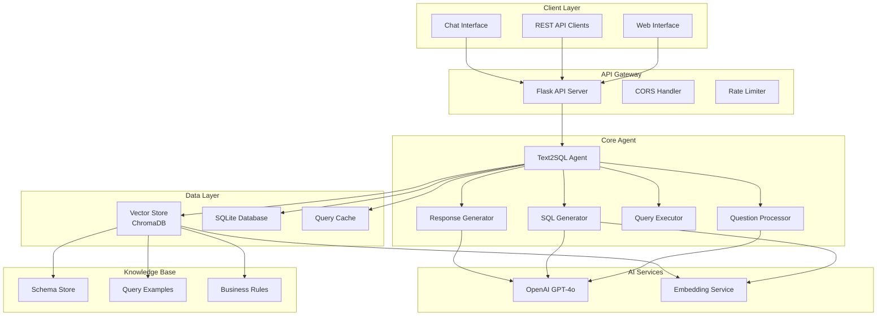
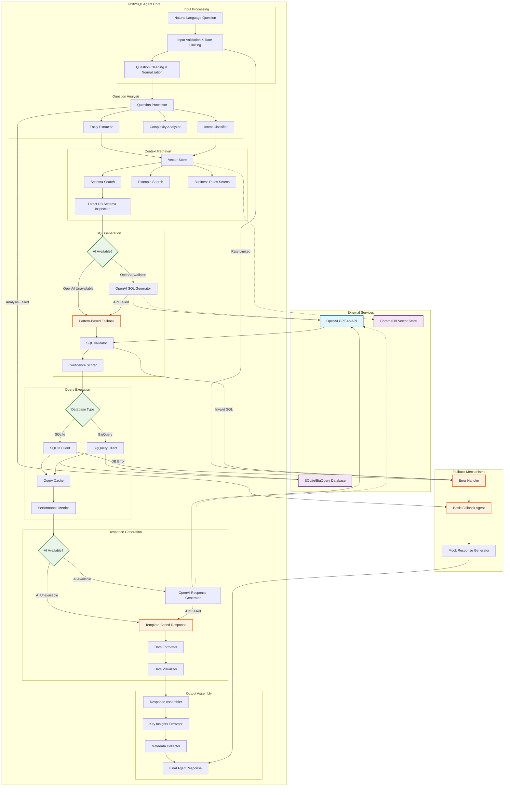
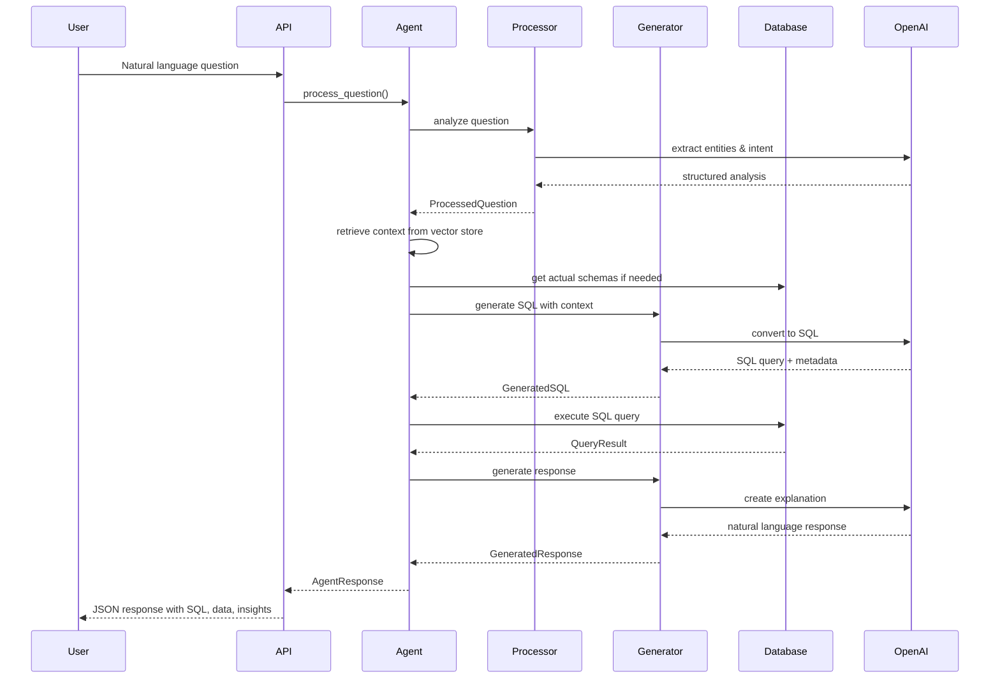
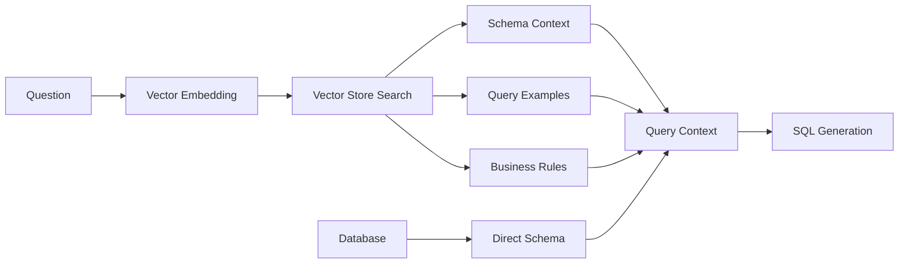

# Text-to-SQL Agent Architecture Overview

## Table of Contents
- [System Overview](#system-overview)
- [High-Level Architecture](#high-level-architecture)
- [Core Components](#core-components)
- [Data Flow](#data-flow)
- [API Architecture](#api-architecture)
- [Database Design](#database-design)
- [Configuration Management](#configuration-management)
- [Deployment Architecture](#deployment-architecture)
- [Security Considerations](#security-considerations)
- [Performance & Scalability](#performance--scalability)
- [Monitoring & Observability](#monitoring--observability)

## System Overview

The Text-to-SQL Agent is an AI-powered system that converts natural language questions into SQL queries for retail analytics. It supports both SQLite (local) and BigQuery (cloud) backends and provides comprehensive analytics capabilities for pricing, elasticity, competitive analysis, and sales performance.

### Key Features
- 🤖 **AI-Powered SQL Generation** using OpenAI GPT-4o
- 🗃️ **Multi-Database Support** (SQLite, BigQuery)
- 📊 **Intelligent Context Retrieval** using vector embeddings
- 🔍 **Schema-Aware Query Generation** with actual database inspection
- 📈 **Automated Data Visualization** and insights
- 🌐 **RESTful API** with comprehensive endpoints
- 💬 **Interactive Web Interface** with real-time chat
- 🛡️ **Robust Error Handling** with fallback mechanisms
- ⚡ **Performance Optimization** with intelligent caching

## High-Level Architecture



## Text2SQL Agent Internal Architecture

The Text2SQL Agent is the core orchestrator that processes natural language questions through a sophisticated pipeline. Here's the detailed internal architecture:



### Agent Processing Flow

The Text2SQL Agent follows a sophisticated multi-stage processing pipeline with robust fallback mechanisms:

#### 1. **Input Processing Stage**
- **Validation**: Rate limiting, input sanitization, length checks
- **Normalization**: Text cleaning, encoding standardization
- **Preprocessing**: Special character handling, format validation

#### 2. **Question Analysis Stage**
- **Entity Extraction**: UPC codes, categories, dates, numbers, zones
- **Intent Classification**: Pricing, elasticity, competitive, sales analysis
- **Complexity Assessment**: Simple lookup vs. complex analytical queries
- **Context Hints**: Table suggestions based on detected patterns

#### 3. **Context Retrieval Stage**
- **Vector Search**: Semantic search for relevant schemas and examples
- **Schema Inspection**: Direct database metadata retrieval as fallback
- **Example Matching**: Find similar successful query patterns
- **Business Rules**: Apply domain-specific logic and constraints

#### 4. **SQL Generation Stage**
- **AI-Powered Generation**: OpenAI GPT-4o with context-aware prompts
- **Pattern-Based Fallback**: Rule-based SQL generation when AI unavailable
- **Validation Pipeline**: Safety checks, syntax validation, logic verification
- **Confidence Scoring**: Reliability assessment for generated queries

#### 5. **Query Execution Stage**
- **Database Routing**: SQLite vs. BigQuery execution paths
- **Connection Management**: Pooling, timeout handling, retry logic
- **Result Caching**: Multi-layer caching for performance optimization
- **Metrics Collection**: Execution time, row counts, error tracking

#### 6. **Response Generation Stage**
- **AI-Enhanced Responses**: Natural language explanations with business context
- **Visualization Creation**: Automatic chart generation based on data patterns
- **Insight Extraction**: Key findings and actionable recommendations
- **Format Optimization**: HTML tables, responsive layouts, accessibility

#### 7. **Output Assembly Stage**
- **Response Packaging**: Combine SQL, data, insights, and metadata
- **Quality Assurance**: Final validation and consistency checks
- **Performance Metrics**: End-to-end timing and success indicators

### Fallback Mechanisms

The agent implements multiple fallback layers to ensure robust operation:

#### **Level 1: Component Fallbacks**
- **Vector Store Unavailable** → Direct database schema inspection
- **OpenAI API Down** → Pattern-based SQL generation
- **Database Connection Issues** → Cached results or error responses

#### **Level 2: Agent-Level Fallbacks**
- **Full AI Failure** → Basic agent with template responses
- **Schema Loading Failure** → Generic retail schema assumptions
- **Complete System Failure** → Graceful error messages with guidance

#### **Level 3: Operational Fallbacks**
- **Rate Limiting** → Queue management and delayed processing
- **Resource Exhaustion** → Result limiting and pagination
- **Network Issues** → Offline mode with cached capabilities

### Error Handling Strategy

```python
def process_question(self, question: str) -> AgentResponse:
    try:
        # Main processing pipeline
        result = self._execute_pipeline(question)
        return result
    except OpenAIError as e:
        # Fallback to pattern-based generation
        return self._fallback_processing(question, error=e)
    except DatabaseError as e:
        # Return cached results or generic error
        return self._handle_db_error(question, error=e)
    except Exception as e:
        # Last resort: basic error response
        return self._create_error_response(question, error=e)
```

### Performance Optimization

The agent employs several optimization strategies:

- **Lazy Loading**: Components initialized only when needed
- **Connection Pooling**: Efficient database connection management
- **Result Caching**: Multi-level caching for repeated queries
- **Batch Processing**: Optimized handling of multiple requests
- **Schema Caching**: Reduced metadata queries through intelligent caching

## Core Components

### 1. Text2SQL Agent (`src/models/text2sql_agent_sqlite.py`)
**Main orchestrator class that coordinates all components**

```python
class Text2SQLAgentSQLite:
    def __init__(self, config: AgentConfig)
    def process_question(self, question: str) -> AgentResponse
    def health_check() -> Dict[str, Any]
```

**Responsibilities:**
- Coordinates the end-to-end question processing pipeline
- Manages component lifecycle and error handling
- Provides health monitoring and metrics collection
- Handles fallback mechanisms when AI services are unavailable

**Key Features:**
- Schema-aware SQL generation using actual database inspection
- Automatic fallback to basic agent when OpenAI is unavailable
- Comprehensive error handling and recovery
- Performance metrics and query statistics tracking

### 2. Question Processor (`src/models/query_processor.py`)
**Analyzes and preprocesses natural language questions**

```python
class QuestionProcessor:
    def process_question(self, question: str) -> ProcessedQuestion
    def extract_entities(self, question: str) -> List[ExtractedEntity]
    def classify_intent(self, question: str) -> str
```

**Functions:**
- **Entity Extraction**: Identifies UPC codes, categories, dates, numbers
- **Intent Classification**: Determines query type (pricing, elasticity, competitive, etc.)
- **Question Normalization**: Cleans and standardizes input text
- **Context Enhancement**: Suggests relevant tables and relationships

**Supported Intent Types:**
- `pricing_analysis` - Price lookups, recommendations, strategies
- `elasticity_analysis` - Price sensitivity and demand analysis
- `competitive_analysis` - Competitor pricing and market position
- `sales_analysis` - Revenue, units sold, performance metrics
- `margin_analysis` - Profitability and cost analysis

### 3. SQL Generator (`src/models/sql_generator.py`)
**Converts natural language to SQL using OpenAI GPT-4o**

```python
class SQLGenerator:
    def generate_sql(self, question: str, context: QueryContext) -> GeneratedSQL
    def validate_sql(self, sql_query: str) -> Tuple[bool, List[str]]
    def classify_query_type(self, question: str) -> str
```

**Features:**
- **Context-Aware Generation**: Uses actual database schemas and sample data
- **SQLite Optimization**: Specialized prompts for SQLite syntax and functions
- **Safety Validation**: Prevents harmful operations (DROP, DELETE, etc.)
- **Confidence Scoring**: Provides reliability metrics for generated queries
- **Query Type Detection**: Automatically categorizes queries for better context

**Prompt Engineering:**
- Database-specific system prompts (SQLite vs BigQuery)
- Schema information with exact column names and types
- Business context and domain knowledge
- Sample data patterns for better understanding
- Error recovery and refinement capabilities

### 4. Vector Store (`src/models/vector_store.py`)
**Manages schema information and query examples using ChromaDB**

```python
class VectorStore:
    def add_schema(self, schema: SchemaInfo)
    def add_example(self, example: QueryExample)
    def search_schemas(self, query: str) -> List[SchemaInfo]
    def search_examples(self, query: str) -> List[QueryExample]
```

**Storage Types:**
- **Schema Information**: Table structures, relationships, descriptions
- **Query Examples**: Previous successful question-SQL pairs
- **Business Rules**: Domain-specific logic and constraints
- **Metadata**: Performance metrics and usage statistics

**Benefits:**
- Semantic search for relevant context retrieval
- Learning from previous successful queries
- Consistent schema representation across queries
- Improved accuracy through context enhancement

### 5. Database Clients

#### SQLite Client (`src/models/sqlite_client.py`)
```python
class SQLiteClient:
    def execute_query(self, query: str) -> QueryResult
    def get_table_schema(self, table_name: str) -> TableSchema
    def list_tables() -> List[str]
    def validate_query(self, query: str) -> Tuple[bool, str]
```

**Features:**
- Intelligent query result caching
- Automatic schema inspection and metadata extraction
- Connection pooling and timeout management
- Sample data extraction for context enhancement
- Performance metrics and query statistics

#### BigQuery Client (`src/models/bigquery_client.py`)
```python
class BigQueryClient:
    def execute_query(self, query: str) -> QueryResult
    def get_table_schema(self, table_name: str) -> Dict
    def list_tables() -> List[str]
```

### 6. Response Generator (`src/models/response_generator.py`)
**Creates natural language responses and visualizations**

```python
class ResponseGenerator:
    def generate_response(self, context: ResponseContext) -> GeneratedResponse
    def create_visualization(self, data: DataFrame) -> str
    def format_data_table(self, data: DataFrame) -> str
```

**Capabilities:**
- **Natural Language Responses**: Business-friendly explanations
- **Data Visualization**: Automatic chart generation (bar, line, pie, scatter)
- **Key Insights Extraction**: Identifies notable patterns and anomalies
- **Format Optimization**: Responsive HTML tables with proper formatting
- **Business Context**: Retail and pricing domain expertise

**Visualization Types:**
- Bar charts for ranking and categorical data
- Line charts for time series and trends
- Scatter plots for correlation analysis
- Pie charts for composition breakdowns
- Histograms for distribution analysis

## Data Flow

### 1. Question Processing Pipeline



### 2. Context Retrieval Process



## API Architecture

### REST API Endpoints (`src/main.py`, `src/routes/api.py`)

#### Core Query Endpoint
```http
POST /api/query
Content-Type: application/json

{
  "question": "Show me the top 10 items by elasticity in frozen food",
  "user_context": {
    "preferences": {},
    "filters": {}
  }
}
```

**Response:**
```json
{
  "success": true,
  "sql_query": "SELECT p.upc_code, p.product_name, e.elasticity_value...",
  "response": "Here are the top 10 most elastic items in frozen food...",
  "data_table": "<table>...</table>",
  "visualization": "data:image/png;base64,...",
  "key_insights": ["Ice cream products show highest elasticity..."],
  "execution_time": 1.23,
  "row_count": 10,
  "confidence_score": 0.95,
  "metadata": {...}
}
```

#### Health Check
```http
GET /api/health
```

**Response:**
```json
{
  "overall_status": "healthy",
  "components": {
    "sqlite": {"status": "healthy", "available_tables": 8},
    "openai": {"status": "healthy", "model": "gpt-4o"},
    "vector_store": {"status": "healthy", "collections": {...}}
  },
  "timestamp": "2025-01-22T10:30:00Z"
}
```

#### Schema Information
```http
GET /api/schema
GET /api/schema?table=products
```

#### Performance Statistics
```http
GET /api/stats
```

#### Example Questions
```http
GET /api/examples
```

### Web Interface Endpoints

#### Main Dashboard
```http
GET /
```
**Features:**
- System status display
- Quick access to APIs
- Example questions gallery
- Performance metrics overview

#### Interactive Chat
```http
GET /chat
```
**Features:**
- Real-time question processing
- SQL query display
- Results visualization
- Query history

## Database Design

### SQLite Schema (Primary Backend)

#### Products Table
```sql
CREATE TABLE products (
    upc_code TEXT PRIMARY KEY,
    product_name TEXT NOT NULL,
    brand TEXT,
    category_level_1 TEXT,
    category_level_2 TEXT,
    category_level_3 TEXT,
    package_size TEXT,
    unit_of_measure TEXT,
    cost REAL,
    base_price REAL,
    price_family TEXT,
    created_date DATE DEFAULT CURRENT_DATE
);
```

#### Pricing Table
```sql
CREATE TABLE pricing (
    id INTEGER PRIMARY KEY AUTOINCREMENT,
    upc_code TEXT REFERENCES products(upc_code),
    store_id TEXT REFERENCES stores(store_id),
    price_date DATE,
    current_price REAL,
    suggested_price REAL,
    price_family TEXT,
    pricing_strategy TEXT,
    price_change_reason TEXT,
    units_impact REAL,
    revenue_impact REAL
);
```

#### Elasticity Table
```sql
CREATE TABLE elasticity (
    id INTEGER PRIMARY KEY AUTOINCREMENT,
    upc_code TEXT REFERENCES products(upc_code),
    category_level_2 TEXT,
    elasticity_value REAL,
    elasticity_category TEXT,
    confidence_level REAL,
    last_updated DATE
);
```

#### Additional Tables
- `stores` - Store information and metadata
- `competitive_pricing` - Competitor price data
- `sales_data` - Historical sales and revenue
- `margin_analysis` - Profitability metrics
- `price_changes` - Price change history

### Vector Store Schema (ChromaDB)

#### Collections
- **schemas**: Table structure and metadata
- **examples**: Successful query patterns
- **rules**: Business logic and constraints

#### Metadata Structure
```json
{
  "table_name": "products",
  "columns": [...],
  "description": "Product catalog with hierarchical categories",
  "sample_data": [...],
  "relationships": [...],
  "last_updated": "2025-01-22T10:30:00Z"
}
```

## Configuration Management

### Environment Variables
```bash
# OpenAI Configuration
OPENAI_API_KEY=sk-...

# Database Configuration
DATABASE_PATH=retail_analytics.db
VECTOR_STORE_PATH=./chroma_db

# Server Configuration
FLASK_HOST=0.0.0.0
FLASK_PORT=6001
ENABLE_DEBUG=false

# Performance Tuning
MAX_RESULTS=1000
ENABLE_CACHE=true
CACHE_TTL=3600
RATE_LIMIT_PER_MINUTE=60
```

### Configuration Classes
```python
@dataclass
class AgentConfig:
    openai_api_key: Optional[str] = None
    database_path: str = "retail_analytics.db"
    vector_store_path: str = "./chroma_db"
    enable_cache: bool = True
    max_results: int = 1000
    enable_visualization: bool = True
    log_level: str = "INFO"
```

## Deployment Architecture

### Local Development
```bash
# Prerequisites
pip install -r requirements.txt

# Environment Setup
export OPENAI_API_KEY="your-key-here"

# Start Server
python src/main.py
```

### Production Deployment

#### Docker Configuration
```dockerfile
FROM python:3.11-slim

WORKDIR /app
COPY requirements.txt .
RUN pip install -r requirements.txt

COPY src/ ./src/
COPY *.db ./
COPY .env ./

EXPOSE 6001
CMD ["python", "src/main.py"]
```

#### Docker Compose
```yaml
version: '3.8'
services:
  text2sql-agent:
    build: .
    ports:
      - "6001:6001"
    environment:
      - OPENAI_API_KEY=${OPENAI_API_KEY}
      - DATABASE_PATH=retail_analytics.db
    volumes:
      - ./data:/app/data
      - ./logs:/app/logs
    restart: unless-stopped
```

#### Kubernetes Deployment
```yaml
apiVersion: apps/v1
kind: Deployment
metadata:
  name: text2sql-agent
spec:
  replicas: 3
  selector:
    matchLabels:
      app: text2sql-agent
  template:
    metadata:
      labels:
        app: text2sql-agent
    spec:
      containers:
      - name: text2sql-agent
        image: text2sql-agent:latest
        ports:
        - containerPort: 6001
        env:
        - name: OPENAI_API_KEY
          valueFrom:
            secretKeyRef:
              name: openai-secret
              key: api-key
```

### Cloud Deployment Options

#### AWS Architecture
- **ECS/Fargate**: Container orchestration
- **ALB**: Load balancing and SSL termination
- **RDS**: Managed PostgreSQL for production data
- **ElastiCache**: Redis for query caching
- **CloudWatch**: Monitoring and logging

#### GCP Architecture
- **Cloud Run**: Serverless container deployment
- **Cloud SQL**: Managed database service
- **Memorystore**: Redis caching layer
- **Cloud Monitoring**: Observability platform

## Security Considerations

### API Security
- **Rate Limiting**: Prevent API abuse
- **CORS Configuration**: Control cross-origin requests
- **Input Validation**: Sanitize all user inputs
- **SQL Injection Prevention**: Parameterized queries only

### Data Security
- **Environment Variables**: Secure credential management
- **Database Encryption**: At-rest and in-transit encryption
- **Access Control**: Role-based permissions
- **Audit Logging**: Track all database operations

### AI Security
- **Prompt Injection Prevention**: Input sanitization
- **Output Validation**: SQL query safety checks
- **API Key Protection**: Secure OpenAI credential handling
- **Usage Monitoring**: Track AI service consumption

## Performance & Scalability

### Caching Strategy
```python
# Query Result Caching
class QueryCache:
    def get(self, query: str) -> Optional[QueryResult]
    def set(self, query: str, result: QueryResult)
    def clear(self)
```

**Cache Layers:**
- **Application Cache**: In-memory query results
- **Database Cache**: SQLite query caching
- **Vector Store Cache**: Embedding and search results
- **HTTP Cache**: Static content and API responses

### Performance Optimizations
- **Connection Pooling**: Efficient database connections
- **Async Processing**: Non-blocking I/O operations
- **Result Pagination**: Large dataset handling
- **Schema Caching**: Reduced metadata queries
- **Batch Processing**: Multiple queries optimization

### Scalability Patterns
- **Horizontal Scaling**: Multiple instance deployment
- **Load Balancing**: Request distribution
- **Database Sharding**: Data partitioning
- **CDN Integration**: Static content delivery
- **Auto-scaling**: Dynamic resource allocation

## Monitoring & Observability

### Health Monitoring
```python
def health_check() -> Dict[str, Any]:
    return {
        'overall_status': 'healthy|degraded|unhealthy',
        'components': {
            'database': {'status': 'healthy', 'latency_ms': 50},
            'openai': {'status': 'healthy', 'rate_limit': '90%'},
            'vector_store': {'status': 'healthy', 'collections': 3}
        },
        'timestamp': '2025-01-22T10:30:00Z'
    }
```

### Performance Metrics
- **Query Processing Time**: End-to-end latency
- **SQL Generation Accuracy**: Success rate and confidence scores
- **Database Performance**: Query execution times
- **AI Service Usage**: OpenAI API consumption
- **Error Rates**: Failed queries and reasons

### Logging Strategy
```python
# Structured Logging
logger.info("Query processed", extra={
    'question': question,
    'sql_query': sql,
    'execution_time': 1.23,
    'row_count': 10,
    'confidence_score': 0.95,
    'user_id': 'user123'
})
```

### Alerting Rules
- **High Error Rate**: >5% failed queries
- **High Latency**: >10s average response time
- **Service Unavailability**: OpenAI or database down
- **Resource Exhaustion**: Memory or disk usage >80%
- **Security Events**: Unusual query patterns

---

## Quick Reference

### Key Files
- `src/main.py` - Main application entry point
- `src/models/text2sql_agent_sqlite.py` - Core agent implementation
- `src/models/sql_generator.py` - SQL generation logic
- `src/models/response_generator.py` - Response formatting
- `src/models/sqlite_client.py` - Database client
- `src/models/vector_store.py` - Vector storage and retrieval

### Default Ports
- **Flask API**: `6001`
- **Gradio Interface**: `7860` (disabled)

### Environment Setup
```bash
export OPENAI_API_KEY="your-key-here"
python src/main.py
```

### Health Check
```bash
curl http://localhost:6001/api/health
```

### Example Query
```bash
curl -X POST http://localhost:6001/api/query \
  -H "Content-Type: application/json" \
  -d '{"question": "Show me top 10 products by price"}'
``` 